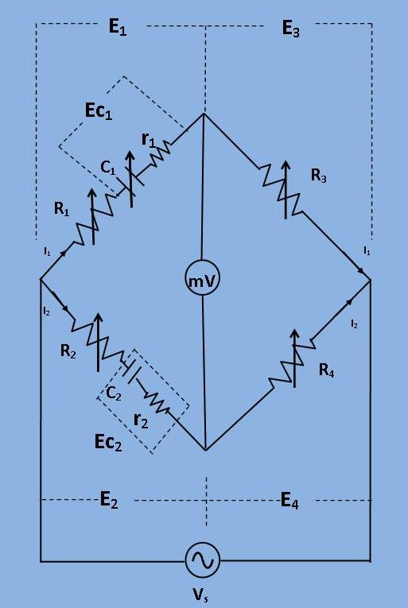
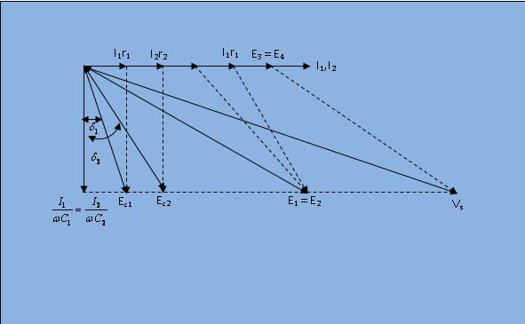

## Introduction

In this bridge, a capacitance is measured with a standard variable capacitance.The connection is shown in the figure. 

This bridge is a modification of De Sauty's bridge.

In this bridge, a capacitance is measured with a standard variable capacitance.The connection is shown in the figure. 
This bridge is a modification of De Sauty's bridge.

***Fig 1: Circuit diagram for measurement of capacitance by De Sauty's Modified Bridge***

	`C_1`= A standard capacitor.
 
							
`C_2`= A capacitor whose capacitance has to be measured.
 
							
 `r_1`,`r_2`= Representing losses of their corresponding capacitors.
 
							
`R_4`,`R_3`= Non-inductive resistances.
 
							
`R_1`,`R_2`= They are connected in series with `C_1` and `C_2` respectively.
 
At balance condition,

`(R_1 + r_1 + 1/ (jomegaC_1))*R_4 = (R_2 + r_2 + 1/ (jomegaC_2))*R_3` 
 

 `(r_1 + R_1)*R_4 + R_4/(jomegaC_1) = (r_2 + R_2)*R_3 + R_3/(jomegaC_2)`

Equating both the real and imaginary parts and separate them,

`R_4/R_3 = (R_2 + r_2)/(R_1 +r_1)` 
							
`C_2 = (R_3/R_4)*C_1`
 
							
`C_2 = ((R_1 + r_1)/(R_2 + r_2))*C_1`
 
							
`C_2 /C_1 = (R_1 + r_1)/(R_2 + r_2) = R_3 /R_4` ...&nbsp;eq.(1)
 
              
The balance may be obtained by variation of  resistances `R_1`, `R_2`, `R_3` and `R_4`.
  
              
 ***Phasor Diagram:***
 

***Fig 1: Phasor diagram for measurement of capacitance by De Sauty's Modified Bridge***

The angles `delta_1` and `delta_2` are the phase angles of `C_1` and `C_2` respectively. The dissipation factors for corresponding capacitors are  
`D_1 =tan(delta_1) =omegaC_1r_1`   &nbsp;&nbsp;    and   &nbsp;&nbsp;   `D_2 =tan(delta_2) =omegaC_2r_2`  

From the eq.(1),
 

`C_2 /C_1 = (R_1 + r_1)/(R_2 + r_2)`
 

`C_2R_2 + C_2r_2 = C_1R_1 + C_1r_1`
 

Multiplying both sides by `omega`,
 

`omegaC_2R_2+ omegaC_2r_2 = omegaC_1R_1 + omegaC_1r_1`
 

`D_2 - D_1 = omega*C_2*(R_1*R_4/R_3 - R_2)`
 

herefore, if the dissipation factor of  one of the capacitors is known, the dissipation factor for the other can be determined .

 
