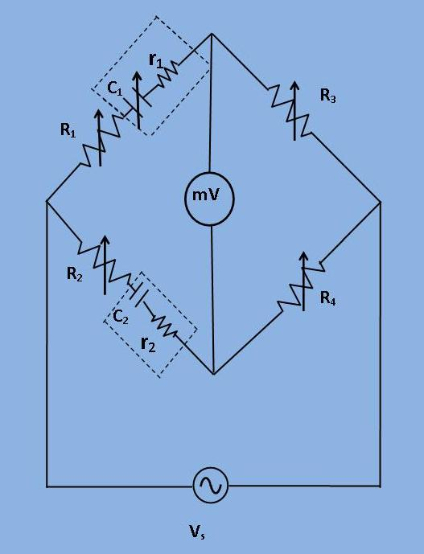

## Procedure

***Fig. 1. Circuit digram of experimental set-up for De Sauty's Modified Bridge***
	

1) &nbsp;Set the voltage (V=3V) and Frequency (50Hz). Also set the unknown capacitance value from 'Set Capacitor Value' tab

							 
							
2) &nbsp;Then switch on the supply to get millivoltmeter deflection.

							 
							
3) &nbsp;Choose the values of &nbsp; R1, R2, R3 R4  and C1 from the resistance and capacitance box through which they can varied wihout bringing database at noise milivoltmeter.

							  
							
4) Observe the milivoltmeter pointer to achieve "NULL".

							  
							
5) If "NULL" is achieved, switch to 'Measure Capacitor Value' tab and click on 'Simulate'. Observe calculated values of unknown capacitance (C2) and unknown internal resistance (r2) of the capacitor.

							  
							
6) Also observe the Dissipation factor of the unknwown capacitor which is defined as  `omega*C*r`. Where,  `omega=2*pi*f`.

