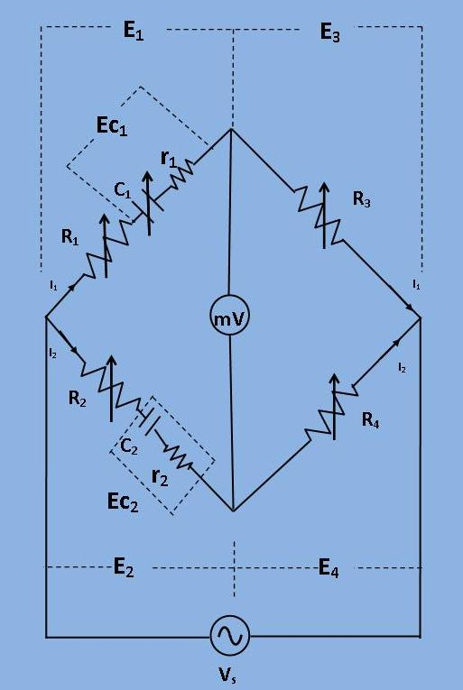

## Theory

In this bridge, a capacitance is measured with a standard variable capacitance.The connection is shown in the figure. 

This bridge is a modification of De Sauty's bridge.

In this bridge, a capacitance is measured with a standard variable capacitance.The connection is shown in the figure. 
This bridge is a modification of De Sauty's bridge.

***Fig 1: Circuit diagram for measurement of capacitance by De Sauty's Modified Bridge***

C1= A standard capacitor.

C2= A capacitor whose capacitance has to be measured.

r1,r2= Representing losses of their corresponding capacitors.

R4,R3= Non-inductive resistances.

R1,R2= They are connected in series with C1 and C2 respectively.

At balance condition,

$$ (R_1 + r_1 + \frac{1}{j \omega C_1})*R_4 = (R_2 + r_2 + \frac{1}{j \omega C_2})*R_3 $$

$$ (r_1 + R_1)*R_4 + \frac{R_4}{j \omega C_1} = (r_2 + R_2)*R_3 +  \frac{R_3}{j \omega C_2} $$

Equating both the real and imaginary parts and separate them,

$$ \frac{R_4}{R_3} = \frac{R_2 + r_2}{R_1 +r_1} $$

$$ C_2 = (\frac{R_3}{R_4})*C_1 $$

$$ C_2 = (\frac{R_1 + r_1}{(R_2 + r_2})*C_1 $$

$$ \frac{C_2}{C_1} = \frac{R_1 + r_1}{R_2 + r_2} = \frac{R_3}{R_4} ...eq.(1) $$

              The balance may be obtained by variation of  resistances 
R1, 
R2, 
R3 and 
R4.
              
 ***Phasor Diagram:***
 

***Fig 1: Phasor diagram for measurement of capacitance by De Sauty's Modified Bridge***

The angles `delta_1` and `delta_2` are the phase angles of `C_1` and `C_2` respectively. The dissipation factors for corresponding capacitors are  
`D_1 =tan(delta_1) =omegaC_1r_1`   &nbsp;&nbsp;    and   &nbsp;&nbsp;   `D_2 =tan(delta_2) =omegaC_2r_2`  

From the eq.(1),
 

`C_2 /C_1 = (R_1 + r_1)/(R_2 + r_2)`
 

`C_2R_2 + C_2r_2 = C_1R_1 + C_1r_1`
 

Multiplying both sides by `omega`,
 

`omegaC_2R_2+ omegaC_2r_2 = omegaC_1R_1 + omegaC_1r_1`
 

`D_2 - D_1 = omega*C_2*(R_1*R_4/R_3 - R_2)`
 

herefore, if the dissipation factor of  one of the capacitors is known, the dissipation factor for the other can be determined .

 
