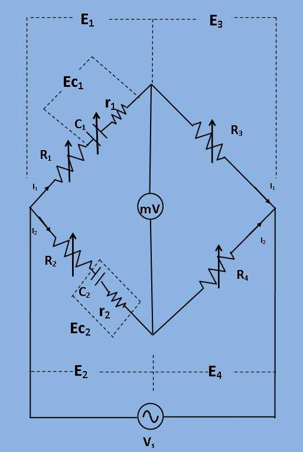

## Theory

In this bridge, a capacitance is measured with a standard variable capacitance.The connection is shown in the figure. 

This bridge is a modification of De Sauty's bridge.

In this bridge, a capacitance is measured with a standard variable capacitance.The connection is shown in the figure. 
This bridge is a modification of De Sauty's bridge.

***Fig 1: Circuit diagram for measurement of capacitance by De Sauty's Modified Bridge***

C1= A standard capacitor.

C2= A capacitor whose capacitance has to be measured.

r1,r2= Representing losses of their corresponding capacitors.

R4,R3= Non-inductive resistances.

R1,R2= They are connected in series with C1 and C2 respectively.

At balance condition,

$$ (R_1 + r_1 + \frac{1}{j \omega C_1})*R_4 = (R_2 + r_2 + \frac{1}{j \omega C_2})*R_3 $$

$$ (r_1 + R_1)*R_4 + \frac{R_4}{j \omega C_1} = (r_2 + R_2)*R_3 +  \frac{R_3}{j \omega C_2} $$

Equating both the real and imaginary parts and separate them,

$$ \frac{R_4}{R_3} = \frac{R_2 + r_2}{R_1 +r_1} $$

$$ C_2 = (\frac{R_3}{R_4})*C_1 $$

$$ C_2 = (\frac{R_1 + r_1}{(R_2 + r_2})*C_1 $$

$$ \frac{C_2}{C_1} = \frac{R_1 + r_1}{R_2 + r_2} = \frac{R_3}{R_4} ...eq.(1) $$

The balance may be obtained by variation of  resistances

$$ R_1, R_2, R_3 \ and \ R_4 $$

 ***Phasor Diagram:***
 

***Fig 2: Phasor diagram for measurement of capacitance by De Sauty's Modified Bridge***

$$ The angles \ \delta_1 \ and \delta_2 \ are \ the  \ phase \ angles \ of \ C_1 \ and \ C_2 \ respectively. \ The \ dissipation \ factors \ for \ corresponding \ capacitors \ are $$

$$ D_1 = tan(\delta_1) = \omega C_1 r_1  \  and \   D_2 =tan(\delta_2) =\omega C_2 r_2 $$

From the eq.(1),
 

$$ \frac{C_2}{C_1} = \frac{R_1 + r_1}{R_2 + r_2} $$

$$ C_2 R_2 + C_2r_2 = C_1R_1 + C_1r_1 $$

Multiplying both sides by  ω

$$ \omega C_2R_2+ \omega C_2r_2 = \omega C_1R_1 + \omega C_1r_1 $$
  
$$ D_2 - D_1 = \omega* C_2*(R_1*\frac{R_4}{R_3} - R_2) $$

herefore, if the dissipation factor of  one of the capacitors is known, the dissipation factor for the other can be determined .
  

 
